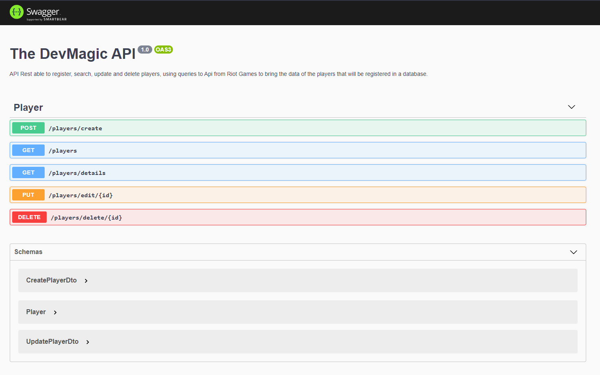

# Challenge - Developer Backend

O desafio é construir uma API Rest que seja capaz de cadastrar, buscar, atualizar e apagar os jogadores. Ela deverá ser capaz de consultar a <a href='https://developer.riotgames.com/'>Api da Riot Games</a> para trazer os dados dos jogadores que serão cadastrados em uma base de dados.

## Instalação
Copie o arquivo ```.env.example``` para o ```.env```. 
```bash
$ cp .env.example .env
```
Instale as dependências do projeto.
```bash
$ yarn install

# ou

$ npm install
```
Antes de proseguir para o proximo passo, copie o arquivo ```.env.example``` para o ```.env```. 
```bash
$ cp .env.example .env
```

Feito isso, edite os valores das variáveis de ambiente para os valores desejados.

Na variável ```RIOT_KEY``` adicione o seu token obtido na <a href='https://developer.riotgames.com/'>API League of Legends</a>.
## Executar a aplicação e banco de dados dentro do Docker
Para executar todo o projeto dentro do docker, apenas execute, no terminal, o seguinte comando:
```bash
$ docker-compose up -d --build
```
A aplicação será executada por default no modo de desenvolvimento: ``yarn start``
## Executar a aplicação localmente e o banco de dados no Docker
Se você desejar executar a aplicação fora do Docker, siga os seguintes passos:

No arquivo ```.env``` atualize o valor da variavel ```TYPEORM_HOST``` de ``pgsql`` para ``localhost``.

    TYPE_ORM=pgsql -> TYPE_ORM=localhost

Execute o banco de dados:

```bash
# Executar apenas o banco de dados PostgreSql
$ docker-compose up -d --build pgsql
```
Aguarde o download, configuração e execução do banco de dados PostgreSql no Docker. 

Após isso, execute a aplicação no modo desejado:
```bash
# Executar a aplição no modo de desenvolvimento
$ (npm run | yarn) start

# Executar a aplição no modo de desenvolvimento com monitoramento de modificações em arquivos
$ (npm run | yarn) start:dev

# Executar a aplição no modo de produção
$ (npm run | yarn) start:prod
```

# REST API

A especificação da REST API para o desafio proposto está descrita abaixo:

## Documentação
### Essa aplicação foi documentada utilizando o Swagger.

- Para acessar a documentação, em seu navegador, digite:

  - ```http://localhost:3000/api```



## Criar um jogador

### Request

> POST ```/players/create```
```json
{
    "summonerName": "OldWolfKing"
}
```
### Curl
```bash
Curl -X 'POST' \
    'http://localhost:3000/players/create' \
    -H 'accept: application/json' \
    -H 'Content-Type: application/json' \
    -d '{
    "summonerName": "summonerName"
    }'
```
### Response Code
> 201
### Response body
```json
{
    "id": "2469725b-5a47-4149-9099-706d9d417d6e",
    "nickname": "Old Wolf King",
    "accountId": "mf_W08JhUo10FvvJrKZaHXpILSYl1UtHFhb0z7e_7R4CUwU",
    "summonerLevel": "235",
    "profileIconId": 3534,
    "summonerId": "5dKiOH-l6JPgZL04748EMj8ZaC2xRzoviOlTOjkvdcdwL3w"
}
```

## Obter lista de jogadores cadastrados

### Request

`GET /players`

```bash
Curl -X 'GET' \
    'http://localhost:3000/players' \
    -H 'accept: application/json'
```

### Response Code

>  200

### Response body
```json
[
  {
    "id": "2469725b-5a47-4149-9099-706d9d417d6e",
    "nickname": "Old Wolf King",
    "accountId": "mf_W08JhUo10FvvJrKZaHXpILSYl1UtHFhb0z7e_7R4CUwU",
    "summonerLevel": "235",
    "profileIconId": 3534,
    "summonerId": "5dKiOH-l6JPgZL04748EMj8ZaC2xRzoviOlTOjkvdcdwL3w"
  },
  {
    "id": "34d9802f-ea70-4d11-b909-67b39169c10b",
    "nickname": "BiliBoss",
    "accountId": "M47rzUIRO1IMiCTtxv5RooQFFyoa-VcOpyXJeqWXlhk",
    "summonerLevel": "42",
    "profileIconId": 1398,
    "summonerId": "6TCoxna5FGbT3j-HOVOoCdGbUffpRYR9Lwp2MfJ1ECX-"
  },
]

```

## Obter lista de jogadores cadastrados com o somatório de vitórias e derrotas

### Request

> GET ```/players/details```

### Curl    
```bash
Curl -X 'GET' \
    'http://localhost:3000/players/details' \
    -H 'accept: application/json'
```

### Response Code

>  200

### Response body
```json
[
   {
    "id": "2469725b-5a47-4149-9099-706d9d417d6e",
    "nickname": "Old Wolf King",
    "accountId": "mf_W08JhUo10FvvJrKZaHXpILSYl1UtHFhb0z7e_7R4CUwU",
    "summonerLevel": "235",
    "profileIconId": 3534,
    "summonerId": "5dKiOH-l6JPgZL04748EMj8ZaC2xRzoviOlTOjkvdcdwL3w",
    "wins": 37,
    "losses": 27
  },
  {
    "id": "34d9802f-ea70-4d11-b909-67b39169c10b",
    "nickname": "BiliBoss",
    "accountId": "M47rzUIRO1IMiCTtxv5RooQFFyoa-VcOpyXJeqWXlhk",
    "summonerLevel": "42",
    "profileIconId": 1398,
    "summonerId": "6TCoxna5FGbT3j-HOVOoCdGbUffpRYR9Lwp2MfJ1ECX-",
    "wins": 0,
    "losses": 0
  }
]

```

## Atualizar summonerName(nickname) e summonerLevel de um jogador
### Request
> PUT  ```​/players​/edit​/{id}```
```json
{
  "summonerName": "New nickname",
  "summonerLevel": 1000
}
```
### Curl
```bash
Curl -X 'PUT' \
'http://localhost:3000/players/edit/2469725b-5a47-4149-9099-706d9d417d6e' \
-H 'accept: application/json' \
-H 'Content-Type: application/json' \
-d '{
"summonerName": "New nickname",
"summonerLevel": 1000
}'
```
### Response Code
> 200
### Response body
```json
{
  "id": "2469725b-5a47-4149-9099-706d9d417d6e",
  "nickname": "New nickname",
  "accountId": "mf_W08JhUo10FvvJrKZaHXpILSYl1UtHFhb0z7e_7R4CUwU",
  "summonerLevel": 1000,
  "profileIconId": 3534,
  "summonerId": "5dKiOH-l6JPgZL04748EMj8ZaC2xRzoviOlTOjkvdcdwL3w"
}
```

## Remover um jogador

> PUT  ```​/players​/delete/{id}```
### Curl
```bash
Curl -X 'DELETE' \
'http://localhost:3000/players/delete/2469725b-5a47-4149-9099-706d9d417d6e' \
-H 'accept: */*'
```
### Response Code
> 200
### Response body
```json
{
  "message": "successfully deleted"
}
```